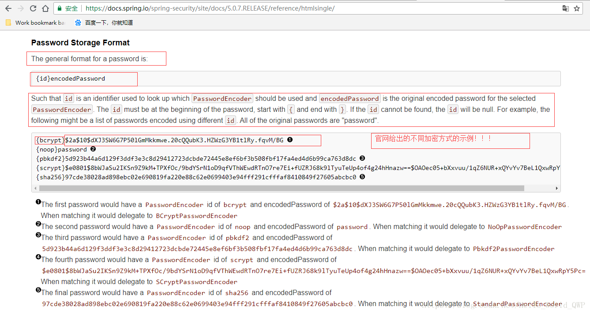

# SpringBoot集成SpringSecurity

Spring Security 就是一个Spring生态中关于安全方面的框架。它能够为基于Spring的企业应用系统提供声明式的安全访问控制解决方案。

Spring Security，是一个基于Spring AOP和Servlet过滤器的安全框架。它提供全面的安全性解决方案，同时在Web请求级和方法调用级处理身份确认和授权。在Spring Framework基础上，Spring Security充分利用了依赖注入（DI，Dependency Injection）和面向切面技术。

Spring Security提供了一组可以在Spring应用上下文中配置的Bean，充分利用了Spring IoC（Inversion of Control, 控制反转），DI和AOP（Aspect Oriented Progamming ，面向切面编程）功能，为应用系统提供声明式的安全访问控制功能，减少了为企业系统安全控制编写大量重复代码的工作，为基于J2EE企业应用软件提供了全面安全服务[0]。Spring Security的前身是 Acegi Security 。


## 初阶： 默认认证用户名和密码

**pom.xml**

```xml
<dependency>
    <groupId>org.springframework.boot</groupId>
    <artifactId>spring-boot-starter-security</artifactId>
</dependency>

<dependency>
    <groupId>org.springframework.boot</groupId>
    <artifactId>spring-boot-starter-web</artifactId>
</dependency>
```


**打开应用：**

.png)


**默认的用户密码是：**

```verilog
// 查看日志
Using generated security password: f164616d-516d-4462-a772-741350c66e25
```

在**SecurityProperties**这个Bean管理了用户名和密码。
在SecurityProperties里面的一个**内部静态类User类**里面，管理了默认的认证的用户名与密码。代码如下:

```java
public static class User {

		/**
		 * Default user name.
		 */
		private String name = "user";

		/**
		 * Password for the default user name.
		 */
		private String password = UUID.randomUUID().toString();

		/**
		 * Granted roles for the default user name.
		 */
		private List<String> roles = new ArrayList<>();

		private boolean passwordGenerated = true;

		public String getName() {
			return this.name;
		}

		public void setName(String name) {
			this.name = name;
		}

		public String getPassword() {
			return this.password;
		}

		public void setPassword(String password) {
			if (!StringUtils.hasLength(password)) {
				return;
			}
			this.passwordGenerated = false;
			this.password = password;
		}

		public List<String> getRoles() {
			return this.roles;
		}

		public void setRoles(List<String> roles) {
			this.roles = new ArrayList<>(roles);
		}

		public boolean isPasswordGenerated() {
			return this.passwordGenerated;
		}

	}
```

想简单改一下这个用户名密码，可以在application.properties配置你的用户名密码，例如

```yaml
# security
spring:
  security:
    user:
      name: wex
      password: 110325
```


## 中阶： 内存用户名密码认证

**定制用户名密码**

写一个extends WebSecurityConfigurerAdapter的配置类:

```java
@Configuration
// 开启Spring Security的功能
@EnableWebSecurity
// 可以开启security的注解，我们可以在需要控制权限的方法上面使用@PreAuthorize，@PreFilter这些注解。
@EnableGlobalMethodSecurity(prePostEnabled = true,securedEnabled = true,jsr250Enabled = true)
public class WebSecurityConfig extends WebSecurityConfigurerAdapter {
    @Override
    protected void configure(HttpSecurity http) throws Exception {
        super.configure(http);
    }

    @Override
    protected void configure(AuthenticationManagerBuilder auth) throws Exception {
        // 内存中创建了一个用户，该用户的名称为root，密码为root，用户角色为USER。
        auth
            .inMemoryAuthentication()
            .withUser("root")
            .password("root")
            .roles("USER");
    }
}

```

**说明：**

1. 注解说明见上面注释

2. extends 继承 WebSecurityConfigurerAdapter 类，并重写它的方法来设置一些web安全的细节。我们结合@EnableWebSecurity注解和继承WebSecurityConfigurerAdapter，来给我们的系统加上基于web的安全机制。

3. 在configure(HttpSecurity http)方法里面，默认的认证代码是：

   ```java
   protected void configure(HttpSecurity http) throws Exception {
       logger.debug("Using default configure(HttpSecurity). If subclassed this will potentially override subclass configure(HttpSecurity).");
   
       http
           // 定义哪些URL需要被保护、哪些不需要被保护。默认配置是所有访问页面都需要认证，才可以访问。
           .authorizeRequests()
           .anyRequest().authenticated()
           .and()
           // 上面的那个默认的登录页面，就是SpringBoot默认的用户名密码认证的login页面
           .formLogin()
           .and()
           .httpBasic();
   }
   ```


**如果要设置多个用户和角色：**

```java
@Override
protected void configure(AuthenticationManagerBuilder auth) throws Exception {
        auth
            .inMemoryAuthentication()
                .withUser("root")
                .password("root")
                .roles("USER")
            .and()
                .withUser("admin").password("admin")
                .roles("ADMIN", "USER")
            .and()
                .withUser("user").password("user")
                .roles("USER");
}
```


#### 新版本问题及解决

此时我们重新打开应用，然后登陆，会发现服务器报错：

```verilog
java.lang.IllegalArgumentException: There is no PasswordEncoder mapped for the id "null"
```

**官网对于此问题的文档解释：**



关于 Spring Security 5.0.X 的说明：
在Spring Security 5.0之前，PasswordEncoder 的默认值为 NoOpPasswordEncoder 既表示为纯文本密码，在实际的开发过程中 PasswordEncoder 大多数都会设值为 BCryptPasswordEncoder ，但是这样会导致几个问题：

1. 在应用程序中使用 BCryptPasswordEncoder 编码方式编码后的密码，很难轻松的迁移；
2. 密码存储后，会再次被更改；
3. 作为一个应用中的安全框架，Spring Security 不能频繁地进行中断更改。

在 Spring Security 5.0.x 以后，密码的一般格式为：{ID} encodedPassword ，ID 主要用于查找 PasswordEncoder 对应的编码标识符，并且encodedPassword 是所选的原始编码密码 PasswordEncoder。ID 必须书写在密码的前面，开始用{，和 结束 }。如果 ID 找不到，ID 则为null。

新建一个 **DemoPasswordEncoder 并实现 PasswordEncoder 接口**，重新 里面的两个方法，并定义为明文的加密方式，具体内容如下：

```java
public class DemoPasswordEncoder implements PasswordEncoder {
    @Override
    public String encode(CharSequence rawPassword) {
        return rawPassword.toString();
    }

    @Override
    public boolean matches(CharSequence rawPassword, String encodedPassword) {
        return encodedPassword.equals(rawPassword.toString());
    }
}
```

```java
@Override
    protected void configure(AuthenticationManagerBuilder auth) throws Exception {
        auth
            .inMemoryAuthentication()
                .withUser("root")
                .password("root")
                .roles("USER")
            .and()
                .withUser("admin").password("admin")
                .roles("ADMIN", "USER")
            .and()
                .withUser("user").password("user")
                .roles("USER")
            .and()
                .passwordEncoder(new DemoPasswordEncoder());
    }
```


#### 角色权限控制

当我们的系统功能模块当需求发展到一定程度时，会不同的用户，不同角色使用我们的系统。这样就要求我们的系统可以做到，能够对不同的系统功能模块，开放给对应的拥有其访问权限的用户使用。

Spring Security提供了Spring EL表达式，允许我们在定义URL路径访问(@RequestMapping)的方法上面添加注解，来控制访问权限。

在标注访问权限时，根据对应的表达式返回结果，控制访问权限：

> true，表示有权限
> fasle，表示无权限

Spring Security可用表达式对象的基类是SecurityExpressionRoot。（源码直接去找）

```java
public abstract class SecurityExpressionRoot implements SecurityExpressionOperations {
	protected final Authentication authentication;
	private AuthenticationTrustResolver trustResolver;
	private RoleHierarchy roleHierarchy;
	private Set<String> roles;
	private String defaultRolePrefix = "ROLE_";

	/** Allows "permitAll" expression */
	public final boolean permitAll = true;

	/** Allows "denyAll" expression */
	public final boolean denyAll = false;
	private PermissionEvaluator permissionEvaluator;
	public final String read = "read";
	public final String write = "write";
	public final String create = "create";
	public final String delete = "delete";
	public final String admin = "administration";

	/**
	 * Creates a new instance
	 * @param authentication the {@link Authentication} to use. Cannot be null.
	 */
	public SecurityExpressionRoot(Authentication authentication) {
		if (authentication == null) {
			throw new IllegalArgumentException("Authentication object cannot be null");
		}
		this.authentication = authentication;
	}

	public final boolean hasAuthority(String authority) {
		return hasAnyAuthority(authority);
	}

	public final boolean hasAnyAuthority(String... authorities) {
		return hasAnyAuthorityName(null, authorities);
	}

	public final boolean hasRole(String role) {
		return hasAnyRole(role);
	}

	public final boolean hasAnyRole(String... roles) {
		return hasAnyAuthorityName(defaultRolePrefix, roles);
	}

	private boolean hasAnyAuthorityName(String prefix, String... roles) {
		Set<String> roleSet = getAuthoritySet();

		for (String role : roles) {
			String defaultedRole = getRoleWithDefaultPrefix(prefix, role);
			if (roleSet.contains(defaultedRole)) {
				return true;
			}
		}

		return false;
	}

	public final Authentication getAuthentication() {
		return authentication;
	}

	public final boolean permitAll() {
		return true;
	}

	public final boolean denyAll() {
		return false;
	}

	public final boolean isAnonymous() {
		return trustResolver.isAnonymous(authentication);
	}

	public final boolean isAuthenticated() {
		return !isAnonymous();
	}

	public final boolean isRememberMe() {
		return trustResolver.isRememberMe(authentication);
	}

	public final boolean isFullyAuthenticated() {
		return !trustResolver.isAnonymous(authentication)
				&& !trustResolver.isRememberMe(authentication);
	}

	/**
	 * Convenience method to access {@link Authentication#getPrincipal()} from
	 * {@link #getAuthentication()}
	 * @return
	 */
	public Object getPrincipal() {
		return authentication.getPrincipal();
	}

	public void setTrustResolver(AuthenticationTrustResolver trustResolver) {
		this.trustResolver = trustResolver;
	}

	public void setRoleHierarchy(RoleHierarchy roleHierarchy) {
		this.roleHierarchy = roleHierarchy;
	}

	/**
	 * <p>
	 * Sets the default prefix to be added to {@link #hasAnyRole(String...)} or
	 * {@link #hasRole(String)}. For example, if hasRole("ADMIN") or hasRole("ROLE_ADMIN")
	 * is passed in, then the role ROLE_ADMIN will be used when the defaultRolePrefix is
	 * "ROLE_" (default).
	 * </p>
	 *
	 * <p>
	 * If null or empty, then no default role prefix is used.
	 * </p>
	 *
	 * @param defaultRolePrefix the default prefix to add to roles. Default "ROLE_".
	 */
	public void setDefaultRolePrefix(String defaultRolePrefix) {
		this.defaultRolePrefix = defaultRolePrefix;
	}

	private Set<String> getAuthoritySet() {
		if (roles == null) {
			Collection<? extends GrantedAuthority> userAuthorities = authentication
					.getAuthorities();

			if (roleHierarchy != null) {
				userAuthorities = roleHierarchy
						.getReachableGrantedAuthorities(userAuthorities);
			}

			roles = AuthorityUtils.authorityListToSet(userAuthorities);
		}

		return roles;
	}

	public boolean hasPermission(Object target, Object permission) {
		return permissionEvaluator.hasPermission(authentication, target, permission);
	}

	public boolean hasPermission(Object targetId, String targetType, Object permission) {
		return permissionEvaluator.hasPermission(authentication, (Serializable) targetId,
				targetType, permission);
	}

	public void setPermissionEvaluator(PermissionEvaluator permissionEvaluator) {
		this.permissionEvaluator = permissionEvaluator;
	}

	/**
	 * Prefixes role with defaultRolePrefix if defaultRolePrefix is non-null and if role
	 * does not already start with defaultRolePrefix.
	 *
	 * @param defaultRolePrefix
	 * @param role
	 * @return
	 */
	private static String getRoleWithDefaultPrefix(String defaultRolePrefix, String role) {
		if (role == null) {
			return role;
		}
		if (defaultRolePrefix == null || defaultRolePrefix.length() == 0) {
			return role;
		}
		if (role.startsWith(defaultRolePrefix)) {
			return role;
		}
		return defaultRolePrefix + role;
	}
}

```

变量defaultRolePrefix硬编码约定了role的前缀是"ROLE_"。

同时，我们可以看出hasRole跟hasAnyRole是一样的。hasAnyRole是调用的hasAnyAuthorityName(defaultRolePrefix, roles)。

SecurityExpressionRoot为我们提供的使用Spring EL表达式总结如下[1]：

| 表达式                         | 描述                                                         |
| ------------------------------ | ------------------------------------------------------------ |
| hasRole([role])                | 当前用户是否拥有指定角色。                                   |
| hasAnyRole([role1,role2])      | 多个角色是一个以逗号进行分隔的字符串。如果当前用户拥有指定角色中的任意一个则返回true。 |
| hasAuthority([auth])           | 等同于hasRole                                                |
| hasAnyAuthority([auth1,auth2]) | 等同于hasAnyRole                                             |
| Principle                      | 代表当前用户的principle对象                                  |
| authentication                 | 直接从SecurityContext获取的当前Authentication对象            |
| permitAll                      | 总是返回true，表示允许所有的                                 |
| denyAll                        | 总是返回false，表示拒绝所有的                                |
| isAnonymous()                  | 当前用户是否是一个匿名用户                                   |
| isRememberMe()                 | 表示当前用户是否是通过Remember-Me自动登录的                  |
| isAuthenticated()              | 表示当前用户是否已经登录认证成功了。                         |
| isFullyAuthenticated()         | 如果当前用户既不是一个匿名用户，同时又不是通过Remember-Me自动登录的，则返回true。 |

**我们设置测试报告页面，只针对ADMIN权限开放:**

**先写一个测试的controller：**

```java
@RestController
public class DemoController {

    @RequestMapping("/")
    @PreAuthorize("hasRole('ADMIN')")
    public String demo(){
        return "success";
    }
}

```

**登陆：**

使用admin用户登陆：

.png)

使用root登陆：

.png)


#### 在Spring Security里面获取当前登录认证通过的用户信息

在Spring Security中，用户信息保存在SecurityContextHolder中。Spring Security使用一个Authentication对象来持有所有系统的安全认证相关的信息。这个信息的内容格式如下：

```json
{
    "accountNonExpired":true,
    "accountNonLocked":true,
    "authorities":[{
        "authority":"ROLE_ADMIN"
    },{
        "authority":"ROLE_USER"
    }],
    "credentialsNonExpired":true,
    "enabled":true,
    "username":"root"
}
```

这个Authentication对象信息其实就是User实体的信息(当然，密码没放进来)。

```java
public class User implements UserDetails, CredentialsContainer {
    private String password;
    private final String username;
    private final Set<GrantedAuthority> authorities;
    private final boolean accountNonExpired;
    private final boolean accountNonLocked;
    private final boolean credentialsNonExpired;
    private final boolean enabled;
        ....
}
```

我们可以使用下面的代码（Java）获得当前身份验证的用户的名称:

```jsx
Object principal = SecurityContextHolder.getContext().getAuthentication().getPrincipal();

if (principal instanceof UserDetails) {
    String username = ((UserDetails)principal).getUsername();
} else {
    String username = principal.toString();
}
```

- 通过调用getContext()返回的对象是SecurityContext的实例对象，该实例对象保存在ThreadLocal线程本地存储中。(使用Spring Security框架，通常的认证机制都是返回UserDetails实例。)


添加一个实现了**javax.servlet.Filter的LoginFilter**，把当前登录信息放到**系统session中**

```java
@Order(1)  // @Order注解表示执行过滤顺序，值越小，越先执行
@WebFilter(filterName = "loginFilter", urlPatterns = "/*") //需要在spring-boot的入口处加注解@ServletComponentScan, 如果不指定，默认url-pattern是/*
public class LoginFilter implements Filter {
    @Override
    public void init(FilterConfig filterConfig) throws ServletException {

    }

    @Override
    public void doFilter(ServletRequest servletRequest, ServletResponse servletResponse, FilterChain filterChain) throws IOException, ServletException {
        // 拿到认证信息
        HttpServletRequest request = (HttpServletRequest)servletRequest;
        HttpSession session = request.getSession();
        Object principal = SecurityContextHolder.getContext().getAuthentication().getPrincipal();

        System.out.println("LoginFilter:" + principal.toString());

        String username = "";
        if (principal instanceof UserDetails) {
            username = ((UserDetails)principal).getUsername();
        }else {
            username = principal.toString();
        }
        // 把用户名放到session中
        session.setAttribute("username", username);
        filterChain.doFilter(servletRequest, servletResponse);
    }

    @Override
    public void destroy() {

    }

}
```

**主配置类要配置扫描的注解：**

```java
@SpringBootApplication
// 在 SpringBootApplication 上使用@ServletComponentScan 注解后，Servlet、Filter、Listener 可以直接通过 @WebServlet、@WebFilter、@WebListener 注解自动注册。
@ServletComponentScan(basePackages = "com.wex.security_demo.filter")
public class SecurityDemoApplication {

    public static void main(String[] args) {
        SpringApplication.run(SecurityDemoApplication.class, args);
    }

}
```

**测试用的controller：**

```java
@RestController
public class DemoController {

    @RequestMapping("/")
    @PreAuthorize("hasRole('ADMIN')")
    public String demo(HttpSession session){
        // 获取刚才放会话中的用户名
        String username = (String) session.getAttribute("username");
        System.out.println(username);
        return username;
    }
}
```

**登陆admin之后可以获得姓名展示：**

.png)


#### SpringBoot注册Servlet、Filter、Listener的方法

我们刚才是使用@WebFilter注解一个javax.servlet.Filter的实现类来实现一个LoginFilter。

基于JavaConfig，SpringBoot同样可以使用如下的方式实现Servlet、Filter、Listener的Bean的配置：

```java
@Configuration
public class WebConfig {


    @Bean
    public ServletRegistrationBean servletRegistrationBean_demo2(){
        ServletRegistrationBean servletRegistrationBean = new ServletRegistrationBean();
        servletRegistrationBean.addUrlMappings("/demo-servlet");
        servletRegistrationBean.setServlet(new DemoServlet());
        return servletRegistrationBean;
    }

    @Bean
    public FilterRegistrationBean filterRegistrationBean(){

        FilterRegistrationBean filterRegistrationBean = new FilterRegistrationBean();
        filterRegistrationBean.setFilter(new LoginFilter());
        Set<String> set = new HashSet<String>();
        set.add("/*");
        filterRegistrationBean.setUrlPatterns(set);
        return filterRegistrationBean;
    }

    @Bean
    public ServletListenerRegistrationBean servletListenerRegistrationBean(){
        ServletListenerRegistrationBean servletListenerRegistrationBean =  new ServletListenerRegistrationBean();
        servletListenerRegistrationBean.setListener(new Log4jConfigListener());
        servletListenerRegistrationBean.addInitParameter("log4jConfigLocation","classpath:log4j.properties");
        return servletListenerRegistrationBean;
    }
}
```


## 进阶：用数据库存储用户和角色，实现安全认证

### 构建数据库和实体类

```mysql
create table user(
    id int primary key auto_increment,
    username varchar(20),
    password varchar(50)
);

insert into user values(1, "wex", "110325");

create table role(
    id int primary key auto_increment,
    role varchar(20)
);

insert into role values(1, "ADMIN");
insert into role values(2, "USER");

create table user_role(
    id int primary key auto_increment,
    user_id int,
    role_id int,
    foreign key(user_id) references user(id),
    foreign key(role_id) references role(id)
);

insert into user_role values(1, 1, 1);
insert into user_role values(2, 1, 2);
```

```java
package com.wex.security_demo.domain;

import lombok.Data;

import javax.persistence.*;
import java.util.List;

@Data
@Entity
@Table(name = "user")
public class UserInfo {
    @Id
//    可以利用这个设置主键自增类型
//    @GenericGenerator(name = "idGenerator", strategy = "uuid")
//    @GeneratedValue(generator = "idGenerator")
    @GeneratedValue
    private Long id;

    //    可以通过该注解绑定，与数据库表同名时不需要绑定
//    @Column(name = "username", unique = true, nullable = false, length = 64)
    private String username;

    private String password;

    @ManyToMany(targetEntity = Role.class, cascade = {CascadeType.PERSIST, CascadeType.MERGE}, fetch = FetchType.EAGER)
    @JoinTable(name = "user_role", joinColumns = {@JoinColumn(name = "userId", referencedColumnName = "id")},
            inverseJoinColumns = {@JoinColumn(name = "roleId", referencedColumnName = "id")})
    private List<Role> roles;
}

```

```java
package com.wex.security_demo.domain;

import lombok.Data;

import javax.persistence.Entity;
import javax.persistence.GeneratedValue;
import javax.persistence.Id;
import javax.persistence.Table;

@Data
@Entity
@Table(name = "role")
public class Role {
    @Id
    @GeneratedValue
    private Long id;
    private String role;
}

```


### 配置Security

同样的，我们要写一个继承WebSecurityConfigurerAdapter的配置类：

```java
@Configuration
// 开启Spring Security的功能
@EnableWebSecurity
// 可以开启security的注解，我们可以在需要控制权限的方法上面使用@PreAuthorize，@PreFilter这些注解。
@EnableGlobalMethodSecurity(prePostEnabled = true,securedEnabled = true,jsr250Enabled = true)
public class WebSecurityConfig extends WebSecurityConfigurerAdapter {
    @Override
    @Bean
    protected UserDetailsService userDetailsService() {
         return new DemoUserDetailService();
    }

    @Override
    protected void configure(HttpSecurity http) throws Exception {
//        super.configure(http);
        http.csrf().disable();

        http.authorizeRequests()
            .antMatchers("/").permitAll()
                .antMatchers("/amchart/**",
                        "/bootstrap/**",
                        "/build/**",
                        "/css/**",
                        "/dist/**",
                        "/documentation/**",
                        "/fonts/**",
                        "/js/**",
                        "/pages/**",
                        "/plugins/**"
                ).permitAll() //默认不拦截静态资源的url pattern （2）
                .anyRequest().authenticated().and()
            // 跳转登录页面url请求路径为/login，我们需要定义一个Controller把路径映射到login.html
                .formLogin().loginPage("/login")// 登录url请求路径 (3)
                .defaultSuccessUrl("/httpapi").permitAll().and() // 登录成功跳转路径url(4)
                .logout().permitAll();
        http.logout().logoutSuccessUrl("/");
    }

    @Override
    protected void configure(AuthenticationManagerBuilder auth) throws Exception {
//        auth
//            .inMemoryAuthentication()
//                .withUser("root")
//                .password("root")
//                .roles("USER")
//            .and()
//                .withUser("admin").password("admin")
//                .roles("ADMIN", "USER")
//            .and()
//                .withUser("user").password("user")
//                .roles("USER")
//            .and()
//                .passwordEncoder(new DemoPasswordEncoder());
        auth.userDetailsService(userDetailsService());
    }
}

```

**认证鉴权信息的Bean，采用我们自定义的从数据库中获取用户信息的DemoUserDetailService类。**

```java
// 从数据库中获取用户信息的操作是必不可少的，我们首先来实现UserDetailsService，这个接口需要我们实现一个方法：loadUserByUsername。即从数据库中取出用户名、密码以及权限相关的信息。最后返回一个UserDetails 实现类。
package com.wex.security_demo.service;

import com.wex.security_demo.dao.UserInfoDao;
import com.wex.security_demo.domain.Role;
import com.wex.security_demo.domain.UserInfo;
import org.springframework.beans.factory.annotation.Autowired;
import org.springframework.security.core.GrantedAuthority;
import org.springframework.security.core.authority.SimpleGrantedAuthority;
import org.springframework.security.core.userdetails.User;
import org.springframework.security.core.userdetails.UserDetails;
import org.springframework.security.core.userdetails.UserDetailsService;
import org.springframework.security.core.userdetails.UsernameNotFoundException;
import org.springframework.stereotype.Service;
import org.springframework.transaction.annotation.Transactional;

import java.util.ArrayList;
import java.util.Collection;
import java.util.List;

@Service
@Transactional
// 作用是在特定用户权限认证时，用于加载用户信息
public class DemoUserDetailService implements UserDetailsService {
    @Autowired
    private UserInfoDao userInfoDao;

    @Override
    public UserDetails loadUserByUsername(String username) throws UsernameNotFoundException {
        UserInfo userInfo = userInfoDao.findByUsername(username);
        System.out.println(userInfo.getUsername() + "login");
        User user = new User(userInfo.getUsername(), "{noop}"+userInfo.getPassword(), true,true,true,true,getAuthority(userInfo.getRoles()));
        return null;
    }

    private List<SimpleGrantedAuthority> getAuthority(List<Role> roles) {
        List<SimpleGrantedAuthority> list = new ArrayList<>();
        for (Role role:roles) {
            list.add(new SimpleGrantedAuthority("ROLE_"+role.getRole()));
        }
        return list;
    }
}

```


